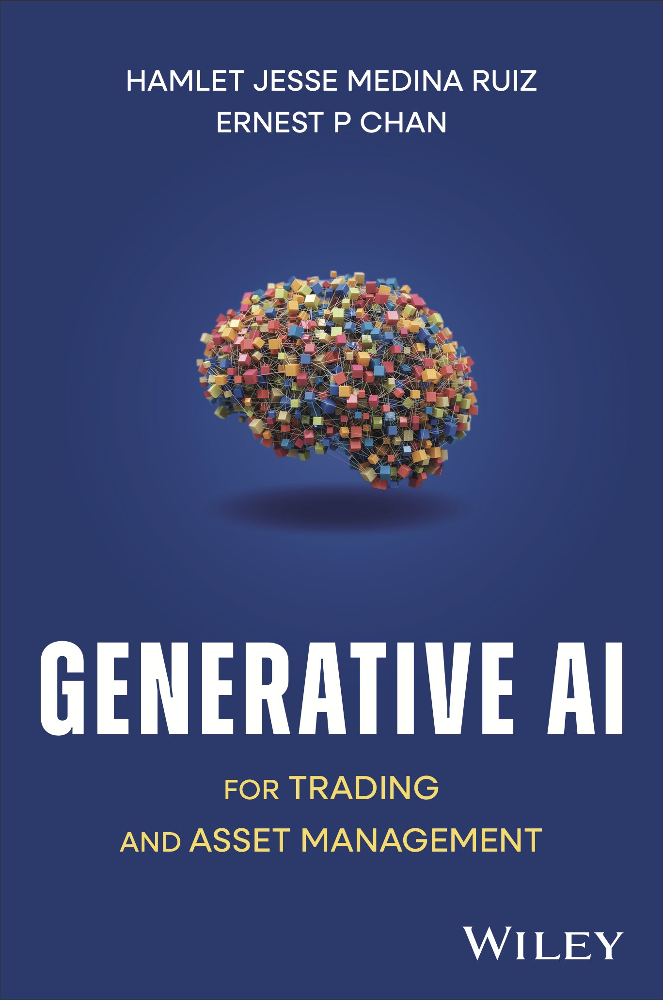

# Generative AI for Trading and Asset Management

Welcome!

This repository contains the example code accompanying our Wiley book  **[Generative AI for Trading and Asset Management](https://www.amazon.com/Generative-AI-Trading-Asset-Management/dp/1394266979/ref=sr_1_1?crid=36FG86OELBSWP&dib=eyJ2IjoiMSJ9.6hWRTYf9V4AdjWipP3ztym3jhFsNSfkNGoCvlg8T-YxIdTAyH5dRbAvaqJCwkSkU.pM5ihs6pqeLz68SmFTOv8Xto19V5GgnY4LSpOx7D82s&dib_tag=se&keywords=Generative+AI+for+Trading+and+Asset+Management&qid=1745913495&sprefix=generative+ai+for+trading+and+asset+management%2Caps%2C320&sr=8-1)**.

<p align="center">
  
</p>

---

## Repository Structure

This repository contains supporting materials and Jupyter notebooks organized by chapter. Below is a brief overview of each chapter's contents:

- **Chapters 1 & 2**: Datasets used in Chapters 1 and 2 of the book.
- **Chapter 4**: Notebook on evaluating generative models, covering both qualitative and quantitative metrics.
- **Chapter 5**: Deep Autoregressive Models — includes examples using models such as RNNs and Transformers for time series forecasting.
- **Chapter 6**: Deep Latent Variable Models — covers Variational Autoencoders (VAEs) for time series generation.
- **Chapter 7**: Flow-Based Models — practical notebooks on NICE, RealNVP on time series generation.
- **Chapter 8**: Generative Adversarial Networks (GANs) — focused on time series generation using GANs.
- **Chapter 10**: Efficient Inference — explores model compression, distillation, and fine-tuning techniques for LLMs.

## Getting Started

### Clone the Repository

To get started, clone the repository to your local machine:

```bash
git clone https://github.com/genai-for-traders/genai-for-trading-and-am.git
```

Move into the project directory:

```bash
cd genai-for-trading-and-am
```

### Set Up Your Environment

We recommend using `conda` to manage your environment.

Create a new environment (for example, named `genai4t`):

```bash
conda create -n genai4t python=3.10
```

Activate the environment:

```bash
conda activate genai4t
```

Alternatively, if you prefer to use `venv`, you can create and activate a virtual environment with:

```bash
python -m venv .venv_genai4t
source .venv_genai4t/bin/activate
```

### Install the Required Packages
Next, install the project's dependencies:

```bash
pip install .
```
Finally, install your preferred Jupyter interface (`notebook` or `lab`):

```bash
pip install jupyter notebook
```

---

## Notes on Running the Notebooks

- **GPU Requirements:**
  Notebooks from Chapter 10, particularly `FinbertDistillationCompression.ipynb` and `LLAMA_3_1_Finetune_Finance.ipynb` require a GPU to run in a reasonable amount of time. If you don't have access to a local GPU, you can run these notebooks on [Google Colab](https://colab.research.google.com/).

- **CPU-Friendly Notebooks:**  
  The majority of other notebooks can be executed on a standard CPU machine within reasonable time.

---

## Tech Stack

This repository primarily uses the following Python libraries:

- **Data manipulation and statistics:**  
  `pandas`, `numpy`, `scipy`, `statsmodels`

- **Machine learning and deep learning:**  
  `scikit-learn`, `pytorch`, `pytorch-lightning`, `unsloth`

- **Time series and forecasting:**  
  `GluonTS`

- **Natural language processing (NLP):**  
  `transformers`

- **Visualization:**  
  `matplotlib`, `seaborn`

--- 

### Project Status

This repository is expected to continue evolving. You can expect ongoing updates, improvements, and new examples in the near future. Stay tuned!


## License and Disclaimer

This repository is licensed under the [MIT License](https://opensource.org/licenses/MIT).

> **Disclaimer:**  
> The code provided in this repository is for educational purposes only.  
> It is distributed on an "AS IS" BASIS, WITHOUT WARRANTIES OR CONDITIONS OF ANY KIND, either express or implied.  
> Any use of the code for financial applications, trading, or investment decisions is done at your own risk and responsibility.  
> We assume no liability for any outcomes resulting from the use of this code.

